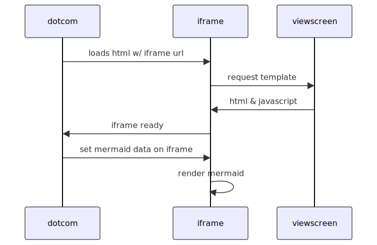

# Test document for Mermaid graphics

# Simple graph

<!-- generated by mermaid compile action - START -->

  
Mermaid markup

<!-- generated by mermaid compile action - END -->

# Another simple graph

<!-- generated by mermaid compile action - START -->

  
Mermaid markup

<!-- generated by mermaid compile action - END -->

# A pie chart

<!-- generated by mermaid compile action - START -->

  
Mermaid markup

<!-- generated by mermaid compile action - END -->

# A sequence diagram

<!-- generated by mermaid compile action - START -->

  
Mermaid markup

<!-- generated by mermaid compile action - END -->

# A state diagram for some simple lexicon structure

Below this text there should be a state diagram:

<!-- generated by mermaid compile action - START -->

  
Mermaid markup

<!-- generated by mermaid compile action - END -->

Above here there should be a state diagram. It should look like the following (taken from [mermaid.live](https://mermaid.live)):

# Final comment

There are no graphs after this point
