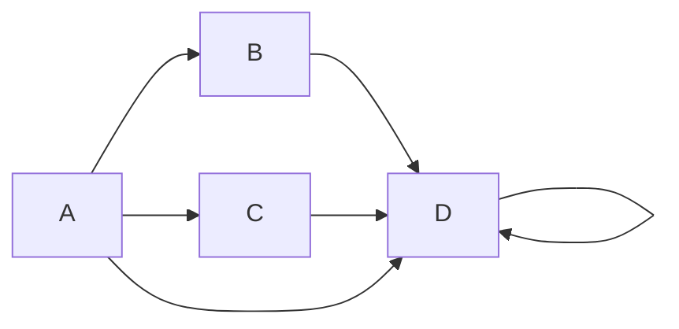
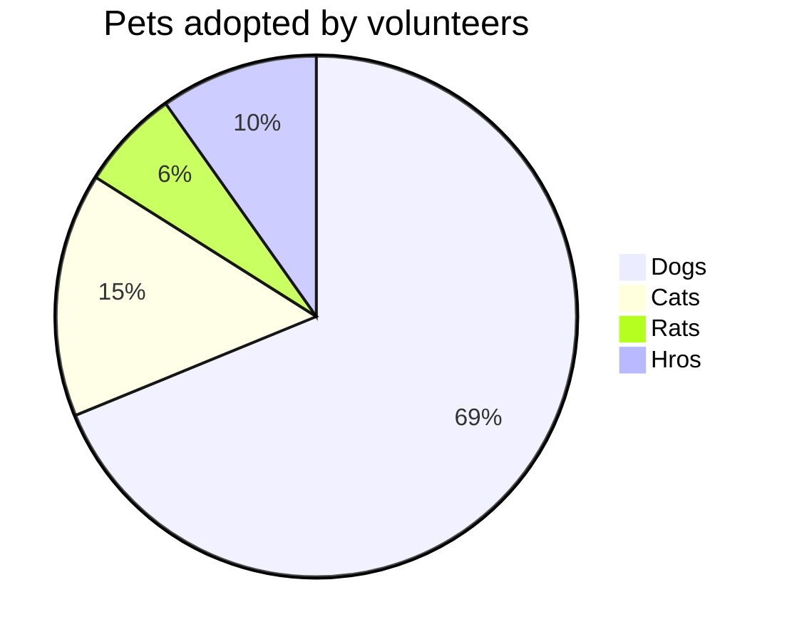
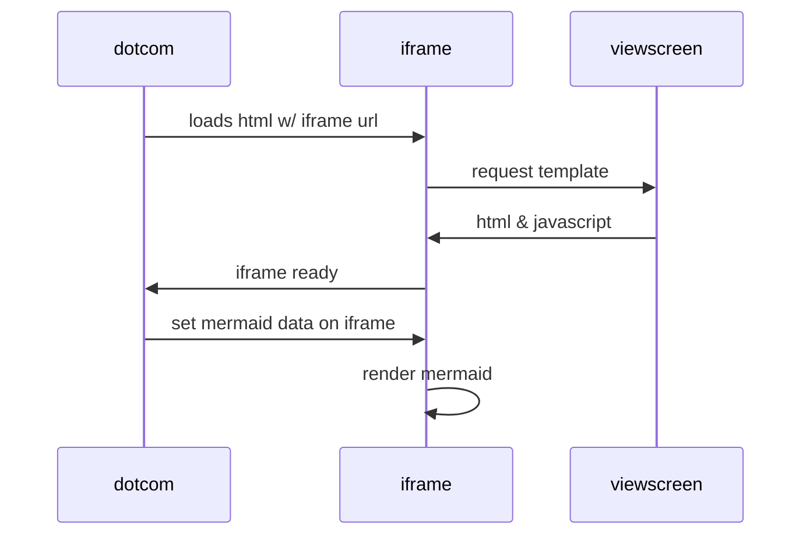

# Test

```mermaid
graph TD;
	A-->B;
	A-->C;
	B-->D;
	C-->D;
```

## One more

```mermaid
graph LR;
	A-->B;
	A-->C;
	B-->D;
	C-->D;
	A-->D;
	D-->D;
```

A pie chart:

```mermaid
pie
  title Pets adopted by volunteers
  "Dogs" : 386
  "Cats" : 85
  "Rats" : 35
  "Hros" : 55
```

And this one:

```mermaid
sequenceDiagram
    participant dotcom
    participant iframe
    participant viewscreen
    dotcom->>iframe: loads html w/ iframe url
    iframe->>viewscreen: request template
    viewscreen->>iframe: html & javascript
    iframe->>dotcom: iframe ready
    dotcom->>iframe: set mermaid data on iframe
    iframe->>iframe: render mermaid
```

And some final text to round it off.
