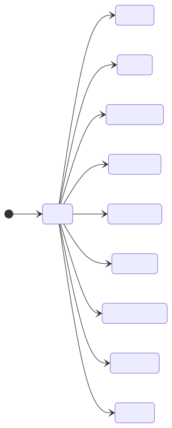

This language module is a testing ground for things and stuff.

# Definitions for `Multichar_Symbols`

## Analysis symbols
The morphological analyses of wordforms for the No linguistic content
language are presented in this system in terms of the following symbols.
(It is highly suggested to follow existing standards when adding new tags).

The parts-of-speech are:

The parts of speech are further split up into:

The Usage extents are marked using following tags:

The nominals are inflected in the following Case and Number

The possession is marked as such:
The comparative forms are:
Numerals are classified under:
Verb moods are:
Verb personal forms are:
Other verb forms are

* +Symbol = independent symbols in the text stream, like £, €, ©
Special symbols are classified with:
The verbs are syntactically split according to transitivity:
Special multiword units are analysed with:
Non-dictionary words can be recognised with:

Question and Focus particles:

Semantics are classified with

Derivations are classified under the morphophonetic form of the suffix, the
source and target part-of-speech.

Morphophonology
---------------

To represent phonologic variations in word forms we use the following
symbols in the lexicon files:

`{aä} {oö} {uü}`

And following triggers to control variation
`{front} {back}`

## Flag diacritics

We have manually optimised the structure of our lexicon using following
flag diacritics to restrict morhpological combinatorics - only allow compounds
with verbs if the verb is further derived into a noun again:

|               Flag diacritic | Explanation
| ---------------------------- | ------------
|  @P.NeedNoun.ON@ | (Dis)allow compounds with verbs unless nominalised
|  @D.NeedNoun.ON@ | (Dis)allow compounds with verbs unless nominalised
|  @C.NeedNoun@ | (Dis)allow compounds with verbs unless nominalised

For languages that allow compounding, the following flag diacritics are needed
to control position-based compounding restrictions for nominals. Their use is
handled automatically if combined with +CmpN/xxx tags. If not used, they will
do no harm.

|              Flag diacritic | Explanation
| --------------------------- | ------------
|  @P.CmpFrst.FALSE@ | Require that words tagged as such only appear first
|  @D.CmpPref.TRUE@ | Block such words from entering ENDLEX
|  @P.CmpPref.FALSE@ | Block these words from making further compounds
|  @D.CmpLast.TRUE@ | Block such words from entering R
|  @D.CmpNone.TRUE@ | Combines with the next tag to prohibit compounding
|  @U.CmpNone.FALSE@ | Combines with the prev tag to prohibit compounding
|  @P.CmpOnly.TRUE@ | Sets a flag to indicate that the word has passed R
|  @D.CmpOnly.FALSE@ | Disallow words coming directly from root.

Use the following flag diacritics to control downcasing of derived proper
nouns (e.g. Finnish Pariisi -> pariisilainen). See e.g. North Sámi for how to use
these flags. There exists a ready-made regex that will do the actual down-casing
given the proper use of these flags.

|               Flag diacritic | Explanation
| ---------------------------- | ------------
|  @U.Cap.Obl@ | Allowing downcasing of derived names: deatnulasj.
|  @U.Cap.Opt@ | Allowing downcasing of derived names: deatnulasj.

The word forms in No linguistic content language start from the lexeme roots of basic
word classes, or optionally from prefixes:

<!-- generated by mermaid compile action - START -->

  
Mermaid markup

```mermaid
stateDiagram-v2
direction LR
[*] --> Root
Root --> Nouns
Root --> Verbs
Root --> Adjectives
Root --> Pronouns
Root --> Numerals
Root --> Prefixes
Root --> Punctuation
Root --> Symbols
```

<!-- generated by mermaid compile action - END -->

* * *

<small>This (part of) documentation was generated from [src/fst/morphology/root.lexc](https://github.com/giellalt/lang-zxx/blob/main/src/fst/morphology/root.lexc)</small>
